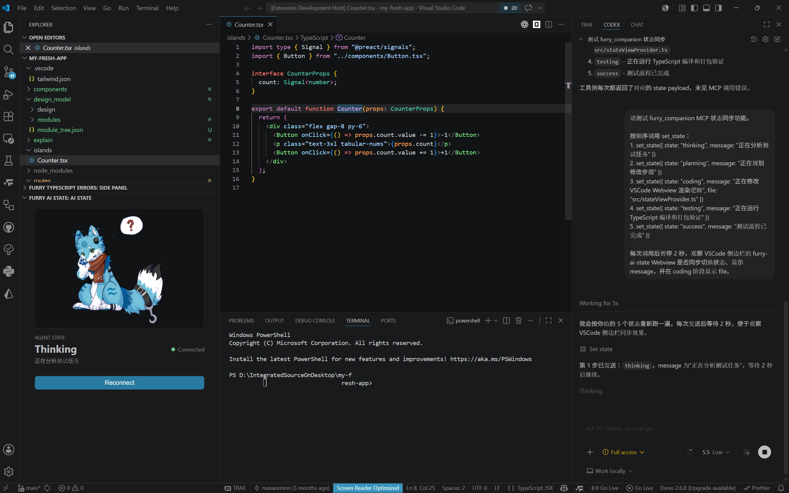
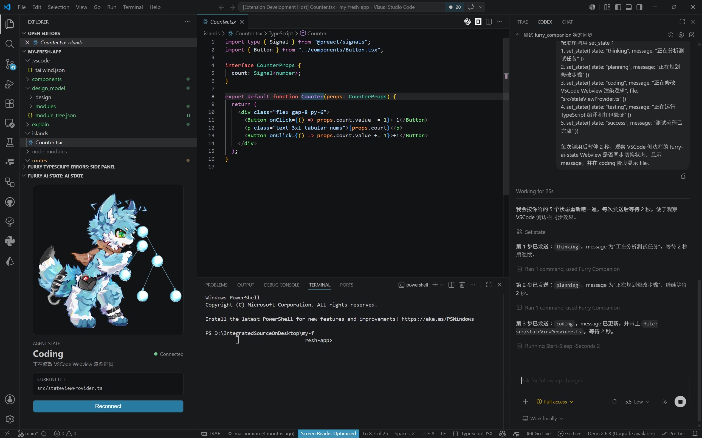
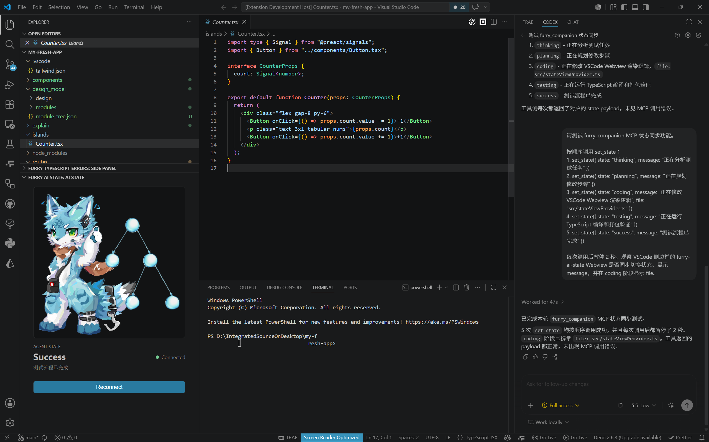
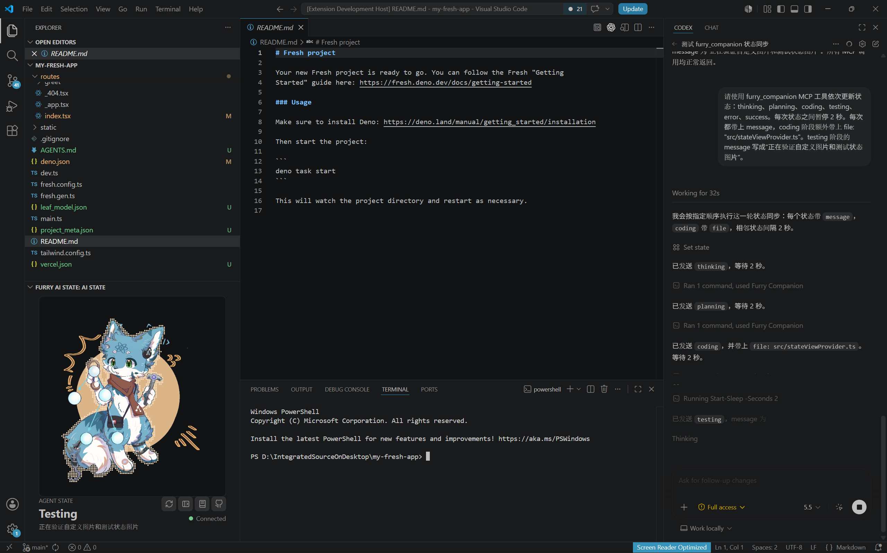

# Furry AI State

`furry-ai-state` is a VSCode extension for visualizing what an AI coding agent is doing. It displays companion illustrations, the current agent phase, optional status text, and the active file reported by the agent runtime.

The extension works with `furry-companion-mcp`, a companion MCP runtime that receives agent state updates through the `set_state` tool and broadcasts them to the VSCode webview through a local IPC bridge.

Project document and instruction: [Feishu document](https://kcnhl2uub4k0.feishu.cn/wiki/OuBCwjPX7iBL9PkZOjccKvGQnGf?from=from_copylink)

Please activate Furry Companion MCP after installing the extension by pasting the prompt to your agent:

```text
Please install Furry Companion MCP for the current environment:

Codex:
codex mcp add furry_companion -- npx -y furry-companion-mcp

Cursor / Claude Desktop:
Add:
{
"mcpServers": {
"furry_companion": {
"command": "npx",
"args": ["-y", "furry-companion-mcp"]
}
}
}

After installation, please restart the Agent session and verify if set_state appears in MCP tools.

If it fails:
1. First, confirm that Node.js and npm are available: node-v&&NPM-v
2. The test package can run: npx-y furry companion mcp
3. If prompted with permission or network errors, clear the npm cache and retry: npm cache verify
If MCP already exists, remove the old configuration first and then add it again.
```

## Preview

### Thinking State



### Coding State



### Completed State



### Testing State


